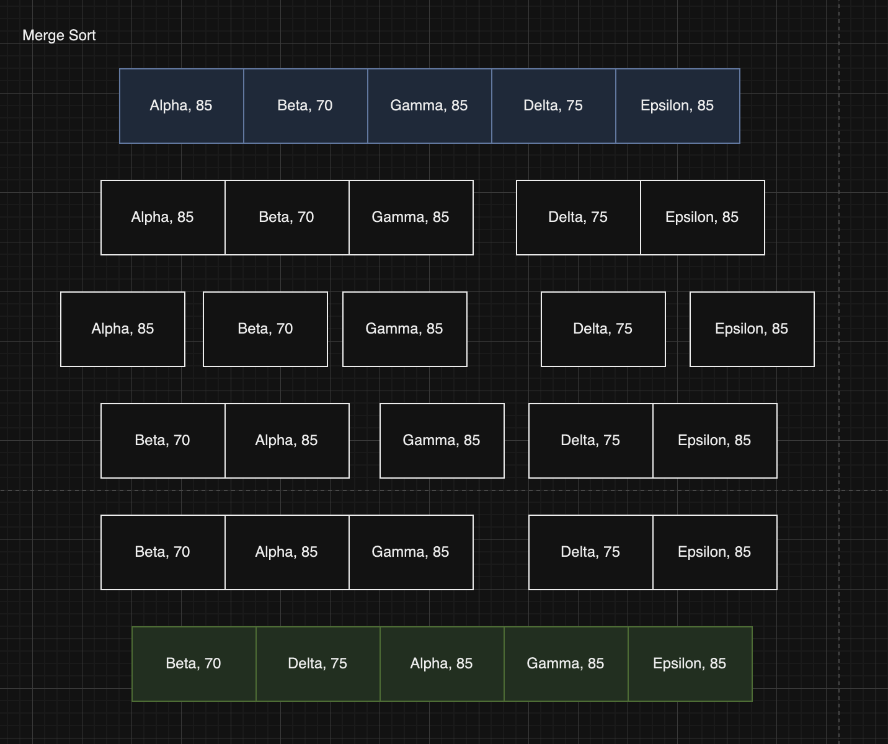
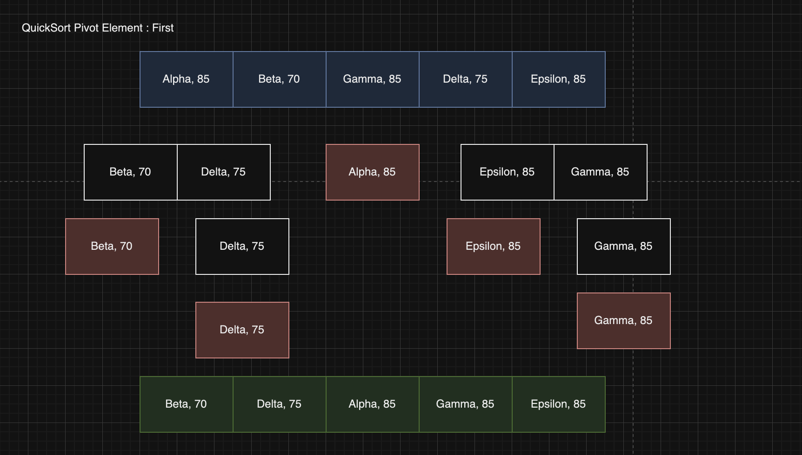
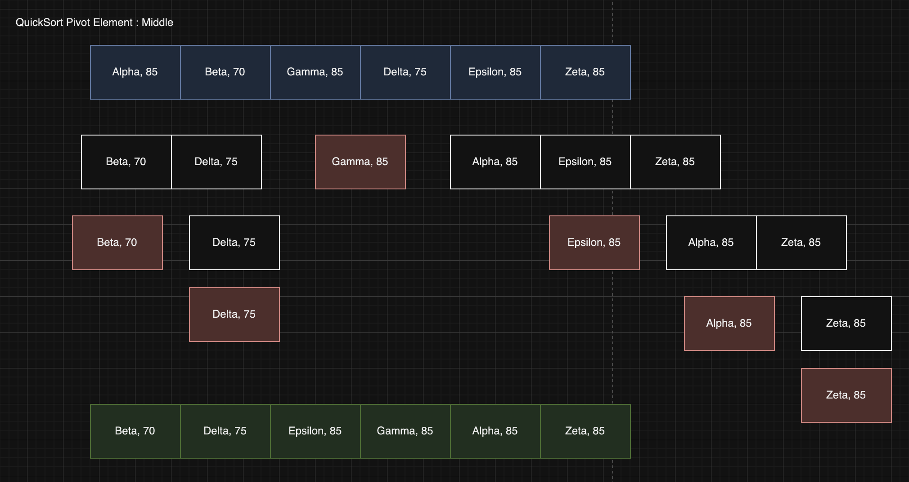
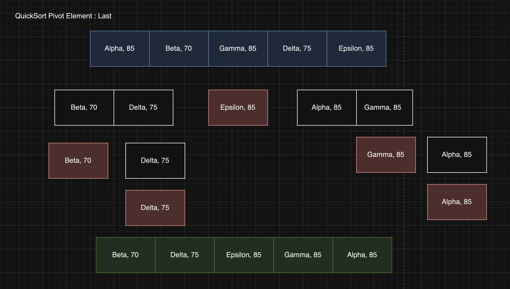

## Extra Credit - Bonus Questions: "An assortment of sorting techniques"

#### Merge Sort:
Stable sorting algorithm that divides an array in half and sorts when rebuilding the array.

#### Quick Sort:
Unstable sorting algorithm that utilizes a pivot element (first, median, or last element) optimizing on comparisons than swaps.
This algorithm is faster because comparing elements is faster than swapping elements themselves. Worst case is theta(n^2) but average case is the same as merge sort.

### Why would this property be useful? Is there an issue if this property does not hold good for a sorting algorithm?

Stability is useful because it ensures that elements are in relative order when sorting. Example comparison:

####  Merge sort sorts the nodes ensuring order.

#### Quick sort

##### First ELement Pivot

The Quick soort algorithm sorts the nodes in a stable order however that is not always the case.

##### Middle Element Pivot

Here the algorithm doesn't retain the order of the "85" values. Where *Gamma* leads the "85" value block rather than *Alpha*

##### Last Element Pivot

Similarly, *Episilon* leads the "85" value block.

#### Why is it important?

From the previous values, without stability, we can inadvertenly swap positions of values. This is imprtant with databases and lists, where ordering matters through intuitive recollection. It'll become disorienting if elements sorted swap positions each time it sorts from a user standpoint.